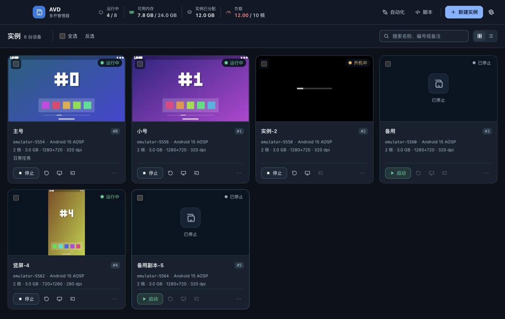
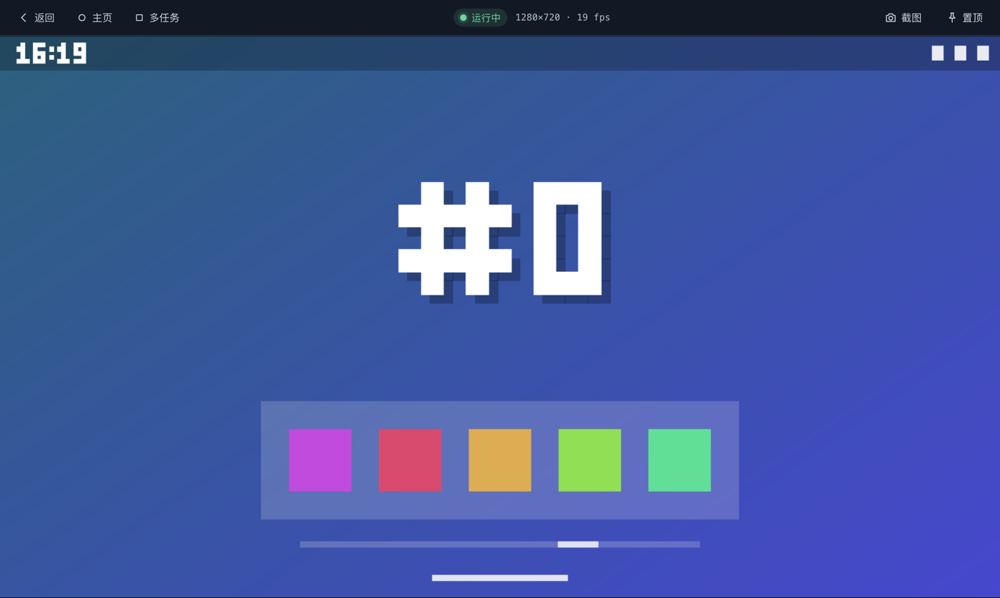
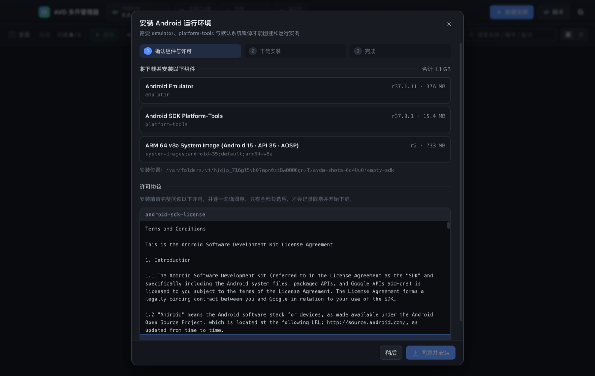
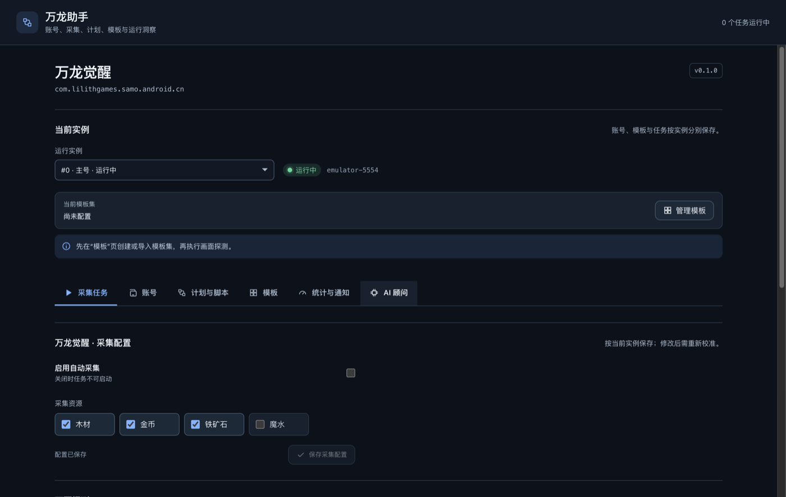

# AndroidAutomation · AVD 多开管理器

**Android Emulator multi-instance manager and game assistant for Apple Silicon macOS.** Create, clone, and launch Android Virtual Devices (AVDs) with the manager app or CLI; run game workflows in a separately installed assistant app.

[下载 macOS 安装包 / Download for macOS](https://github.com/TgolMsk/AndroidAutomation/releases) · [快速开始](#快速开始)

在 Apple Silicon Mac 上批量创建、启动和控制 **Google 官方 Android Emulator** 实例的个人工具。
arm64 系统镜像通过 Hypervisor.framework（HVF）虚拟化运行，图形走 gfxstream → Metal。
提供三个独立入口，底层共用 `@avdm/core`：

- **命令行 `avdm`**：适合脚本化和批量操作
- **AVD 多开管理器**：SDK、实例墙、缩略图、实时画面和批量操作
- **万龙助手**：`wanlong-panel` 的完整移植，管理万龙觉醒的账号、采集、脚本、告警与统计；单独安装和启动

不依赖 Java：SDK 组件下载、许可确认、AVD 创建与克隆都由本项目直接完成，不调用 `sdkmanager` / `avdmanager`。



| 实时画面窗口 | 首次启动 SDK 向导 |
| --- | --- |
|  |  |

上方是独立 **AVD 多开管理器** 的实例墙、实时画面和 SDK 向导。下方是另行安装的 **万龙助手** 自动化工作台：



> 截图由 `pnpm screenshots` 在隔离临时目录中用假 SDK 生成：实时画面是合成的“主屏幕”，万龙助手没有连接真实游戏或账号。

## 功能

- **SDK 管理**
  - 从 `dl.google.com` 读取官方清单，下载 emulator、platform-tools 和 arm64 系统镜像。
  - 支持断点续传和 SHA-1 校验，自动使用系统代理。
  - 许可协议必须在你明确同意后才会被记录。
- **实例**
  - 批量新建，可设 CPU、内存、分辨率、DPI、数据盘、GPU 模式、有无窗口、冷启动或快速启动。
  - APFS 写时复制克隆：几乎瞬间完成，也不额外占用空间。
  - 改名、备注、修改规格、删除。
- **生命周期**
  - 批量启动和停止，可设并发数；默认经控制台优雅关机，同时保存 Quick Boot 快照。
  - 崩溃、强制停止或开机途中被停止之后，下一次启动自动冷启动（`-no-snapshot-load`），不会加载过期的快照而回滚磁盘数据，也会顺带重建损坏的快照。
  - 启动前做准入检查：最大运行数、可用内存、内存压力。
  - 自动检测端口冲突。
  - 健康监控，崩溃后可自动重启（10 分钟内最多 3 次）。
- **设备操作**
  - 按选择器批量执行 `adb shell`、安装 APK、启动或停止应用、截图、点击、滑动、按键、输入文本。
  - 用 scrcpy 打开画面。
- **设备标识（当前 AOSP 镜像）**
  - 可为每个实例随机生成或按模板配置系统序列号、Wi-Fi 接口 MAC、系统 Android ID；具体值保存在实例记录中，普通重启不会重新抽取。
  - Android ID 变更会轮换 AOSP 每用户的 SSAID 种子，使已安装应用下次启动时也获得新的应用级 ID。不同应用的 ID 仍由 Android 各自计算。
  - 模板可配置品牌、厂商、型号、设备代号、产品名和构建指纹；应用进程的 `Build.*` 字段实测会读取配置值。
- **桌面实时画面**
  - 画面通过 gRPC 以 RGB888 流传输。模拟器最高推 60 fps，桌面端限制为 30 fps；画面按变化推送，静止时显示“画面静止”。
  - 鼠标操作映射为触控，键盘输入转发到设备；Android 旋转后画面自动转正，触控坐标随之换算。
  - 工具条有返回、主页、多任务、截图、置顶。
- **脚本插件**：任意语言写的脚本，每个实例各跑一个进程，并通过环境变量拿到 `ANDROID_SERIAL`、adb 路径、gRPC 端口等。
- **独立万龙助手（预览）**：原 Windows 版万龙面板（`wanlong-panel`）的完整移植，功能清单见下文「[万龙助手](#万龙助手)」。OpenCV 识别、采集与脚本都在工作线程里跑，操作按实例串行；自动采集、手机远程操作、AI 自动处理、卡死自动重启都默认关闭。
- **安全默认**：gRPC 始终加 `-grpc-use-token`，只监听 127.0.0.1 并要求令牌；`--json` 输出里不会出现令牌。

Android ID 在 Android 8 及以上按应用签名、用户和设备区分，模板中的 `androidId` 是系统工具可见值，同时触发应用级种子轮换，**不代表所有应用都会读到相同值**。当前官方模拟器没有可配置的 IMEI，本项目尚未实现它。Android 10 及以上对普通应用读取序列号和 MAC 有权限限制，Wi-Fi 也可能按网络随机化 MAC。构建属性不会改变内核、图形驱动、硬件证明或模拟器标记，不能保证被识别为真机。

克隆会复制用户数据；当克隆体使用新的随机标识时，会在首次启动轮换 Android ID 种子，避免沿用源实例的应用级 ID。Android ID 轮换会改变已安装应用的设备身份，可能触发重新登录。

## 环境要求

| 项目 | 要求 |
| --- | --- |
| 硬件 | Apple Silicon（M1 及以上）。只支持 arm64 镜像，Intel Mac 不支持 |
| 系统 | macOS（开发与实测环境为 macOS 26 / M4 24 GB）。Linux 和 Windows 的代码路径只保证不崩溃，未经测试 |
| Node.js | 仅源码构建需要 ≥ 22.18（使用 Node 26 开发；e2e 脚本依赖 Node 原生 TypeScript 类型剥离） |
| pnpm | 仅源码构建需要 11.x（见 `packageManager` 字段） |
| Android Emulator | ≥ 36.6.11（修复了 macOS 26 上的 HVF 内存泄漏），`avdm doctor` 会检查 |
| 磁盘 | 下载约 1.1 GB（emulator 376 MB + platform-tools 15 MB + Android 15 AOSP 镜像 733 MB）。每个实例首次启动后约 3.5 GB（含快照），克隆共享数据块 |
| 内存 | 默认规格每个实例分配 3 GB。冷启动的实例实际占用约 1.1 GB（HVF 按需分配）；从 Quick Boot 快照启动的约 2.3 GB（客体内存映射自快照文件，`ps` 的 RSS 会严重低估） |
| 可选 | [scrcpy](https://github.com/Genymobile/scrcpy)（`brew install scrcpy`，用于 `avdm view` 和卡片上的 scrcpy 按钮） |

## 快速开始

### macOS 安装包

从 [GitHub Releases](https://github.com/TgolMsk/AndroidAutomation/releases) 下载两个独立安装包：`AVDM-*-mac-arm64.dmg` 安装“AVD 多开管理器”；`Wanlong-Assistant-*-mac-arm64.dmg` 安装“万龙助手”。按需安装其中一款或两款。万龙助手需要本机已有兼容的 SDK；SDK 首次配置可用多开管理器或 CLI 完成，实例可以在任一应用里创建。打开各自 DMG，将应用拖入“应用程序”。安装版不需要 Node.js 或 pnpm。第一次在没有 Android SDK 的 Mac 上启动多开管理器时，向导会提示阅读并同意许可，随后下载约 1.1 GB 的模拟器、平台工具和 ARM64 系统镜像。

模拟器安装包同时提供命令行：`'/Applications/AVD 多开管理器.app/Contents/Resources/bin/avdm' list --json`。可选地将这个文件建立符号链接到自己的 `PATH`；完整用法见 [模拟器 API 与 CLI](docs/EMULATOR_API.md)。

当前预览版使用临时签名，尚无 Developer ID 签名和公证；macOS 首次打开时可能需要在“系统设置 → 隐私与安全性”中允许。安装包不含 Google SDK、系统镜像或游戏 APK，因此首次完整使用需要联网和可用的下载源。只支持 Apple Silicon。

### 从源码运行

```bash
pnpm install
pnpm build                      # 构建 core → automation → cli → desktop

# 可选：起个别名
alias avdm="node $PWD/packages/cli/dist/index.js"

avdm doctor                     # 体检：SDK、emulator 版本、adb、HVF、镜像、主机资源
avdm sdk install                # 下载 emulator + platform-tools + 默认镜像（见下方许可说明）
avdm create -n 3                # 新建 3 个实例（默认 2 核 / 3 GB / 1280x720 横屏 / 320 dpi）
avdm start all --wait           # 启动并等待开机完成（冷启动约 16 秒，快照启动约 5 秒）
avdm list                       # 查看状态
avdm view 0                     # 用 scrcpy 打开 #0 的画面
avdm stop all                   # 优雅关机并保存快照
```

没设别名时，也可以在仓库根目录用 `pnpm avdm <命令>`。

**SDK 位置**：默认与 Android Studio 共用 `~/Library/Android/sdk`。设置了 `ANDROID_HOME` 或 `ANDROID_SDK_ROOT` 时用它们；也可以用 `avdm settings set sdkRoot <路径>` 指定。

**许可说明**：`avdm sdk install` 会先显示所需许可的全文（较长时用分页器），然后逐条询问 `是否接受许可 <id>？[y/N]`。只有回答 `y`，才会把许可哈希写入 `<sdk>/licenses/`；这个格式与 Android Studio 通用。
- 非交互环境（管道或 `--json`）默认拒绝继续。stdout 被重定向（如 `avdm sdk install > install.log`）时，许可全文和提问改为显示在终端的 stderr 上；stdout 与 stderr 都不是终端时拒绝继续。
- 如果你已经读过并同意，可以加 `--accept-licenses` 跳过询问。
- 用管道输入 `yes | avdm sdk install` **不会**被当作同意。

### 从源码运行两个桌面应用

```bash
pnpm build
pnpm start:desktop              # AVD 多开管理器（packages/desktop）
pnpm dev:desktop                # 多开管理器开发模式
pnpm build:wanlong              # 单独构建万龙助手
pnpm start:wanlong              # 运行万龙助手构建产物
pnpm dev:wanlong                # 万龙助手开发模式
```

- **首次启动**：缺少组件时会自动打开 SDK 向导。向导列出将下载的组件和大小，并显示每个许可的全文；每个许可都有自己的“我已阅读并同意许可 <id>”勾选框，全部勾选后才能安装。退出应用会先询问是否取消正在进行的安装。
- **关闭窗口**：模拟器在后台继续运行；按 ⌘Q 退出应用时也不会关掉模拟器。
- **共享数据**：CLI、多开管理器和万龙助手共用 `~/.avdm`；设置 `AVDM_HOME` 可把三个入口一起切换到另一个数据目录。CLI 的实例改动会同步到多开管理器界面。
- **打包**：`pnpm dist:mac` 构建多开管理器；`pnpm dist:mac:wanlong` 构建万龙助手。推送 `v*` 标签后，GitHub Actions 构建并上传两个独立 DMG。

### 万龙助手

万龙助手是 `wanlong-panel` 的完整移植，驱动层换成 `@avdm/core`（不再用 MuMu / 雷电）。左侧导航按原版分成七个入口：

- **设备与账号**：模拟器实例页（启动 / 停止 / 重启 / 实时画面 / 新建 / 克隆 / 删除，停止、重启、删除前检查占用）；基础实例与批量克隆（1–8 个，默认轮换设备标识，继承模板集）；账号按实例创建时间绑定，交互式手机号登录，登录后按城内 / 世界地图模板验证。
- **自动采集**：G0–G16 采集状态机，按部队面板倒计时做 ETA 调度（到点先只读采样，有空位才派兵）。冷启动时用 monkey 拉起游戏，门槛前只允许关弹窗、一次 BACK 加「取消」退出框。首次启用前要做只读探针并确认。
- **运行记录**：脚本计划（按账号勾选脚本，北京时间每天 / 间隔触发）。脚本优先于采集：执行前调度器让路（`suspendForScript`），结束后重读队列。执行监控页提供实时日志、留痕截图、暂停 / 继续 / 停止。
- **数据统计**：按北京日期统计派兵、预计采集量、完成趟数、失败与熔断（分开计）、告警、暂停时长，另有资源统计快照（道具 → 资源统计表，精度 0.1 亿，只用于对账）和最近 14 天。
- **AI 处理**：认不出界面时问视觉大模型（OpenAI 兼容接口，限频熔断）。「自动处理」默认关闭：关着时只记录建议；开着时只点关闭 / 取消，点完必须复验，关闭按钮可以自学成模板。
- **脚本与模板**：JSON 脚本 DSL 与可视化块编辑器（从画面截取模板直接成块）；模板库支持去底预览、差分掩码与方差守卫，「导入 / 合并旧模板集」只增不改。
- **设置**：通知与推送（本机 / Telegram，凭据用系统钥匙串加密）、异常告警（掉线 / 顶号 / 连续失败时先暂停再推送）、卡死看门狗（「卡死自动重启」默认关闭）、Telegram 机器人（只认 Chat ID 加授权用户 ID；「查看状态与截图」与「远程操作」两个开关，默认都关）、留痕策略、应用内更新（查 GitHub Release、校验 SHA256 后打开 DMG）。

**模板随安装包分发。** 原面板的「万龙觉醒」模板集（127 张，加游戏资源更新的 4 张，含资源统计模板）在 `apps/wanlong-assistant/resources/templates/`，每次启动只增不改地补进 `~/.avdm/automation/templates/wanlong/`，没选模板集的实例默认用它；你改过的、AI 自学的模板不会被覆盖。也可以在「脚本与模板 → 模板库」用「导入 / 合并旧模板集」导入自己的模板集，或从截图裁切。账号、截图和运行记录都只存在 `~/.avdm/automation/`。应用图标与资源徽章沿用原面板的龙形标志和资源图标（重新生成：`pnpm --filter @avdm/wanlong-assistant run icons:app` / `run icons`）。

**分辨率**：模板与字形按 2560×1440 参考坐标。建议把实例建成 2560×1440，至少 1920×1080。分辨率更低时小图标和数字的识别不可靠，模板页和探针结果会提示。

真实 #1 已通过无派兵的 G0 导航和单轮流程。真实派兵、长期挂机、Telegram 收发和外部 AI 服务，要在你配置好账号、模板、Token 或模型之后自行实机验收，请先在测试实例上使用。

两个应用的边界与调用方式见 [双应用架构](docs/APPLICATIONS.md)；可复用的模拟器调用接口见 [模拟器核心 API 与 CLI](docs/EMULATOR_API.md)；新增游戏的设备适配、视觉模块、配置与任务契约见 [自动化架构](docs/AUTOMATION.md)。

## 命令行参考

实例选择器 `<sel>`：`all`、`3`、`0,2,5`、`1-4`、`0,3-5,9`。所有命令都支持 `--json`。
批量操作会逐个打印 `✓ / ✗`，只要有一个失败，退出码就是 1。

**Ctrl-C**：`create`、`clone`、`start`、`stop`、`restart`、`rm`、`set` 会修改实例。对这些命令按一次 Ctrl-C，正在进行的操作会先完成（或回滚），尚未开始的实例被跳过（`⚠ 已跳过`），`--wait` 的等待开机则立即放弃，退出码为 130。只读命令按一次 Ctrl-C 立即退出。任何命令再按一次 Ctrl-C 都会强制退出。关闭终端（SIGHUP）的效果与 Ctrl-C 相同，例如 `script run` 启动的脚本会被停止。

| 命令 | 说明 |
| --- | --- |
| `avdm doctor` | 环境体检（SDK / emulator ≥36.6.11 / adb / HVF / 镜像 / 许可 / 内存 / scrcpy） |
| `avdm diagnose <i> [包名]` | 游戏兼容性诊断（只读）：GLES 版本与驱动、ASTC、Vulkan、ABI、客体内存；给出包名时再查该应用的 ABI 与最近崩溃 |
| `avdm sdk images [--preview]` | Google 仓库中可用的 arm64 系统镜像，标记已安装的 |
| `avdm sdk install [pkg...] [--accept-licenses] [--force]` | 安装组件，默认为 emulator、platform-tools 和 `defaultImage`，已是最新的会跳过 |
| `avdm sdk status` | 已安装的组件与镜像 |
| `avdm create [-n 1] [--name 前缀] [--image 包路径] [--cores 2] [--ram 3072\|4G] [--res 1280x720] [--dpi 320] [--data 16] [--gpu host\|software\|auto] [--gl angle\|translator] [--window] [--cold-boot] [--auto-restart] [--identity-random\|--identity-template 文件]` | 新建实例，命名为 `<前缀>-<编号>` |
| `avdm clone <src> [-n 1] [--name 前缀] [--keep-snapshots] [--identity-random\|--identity-template 文件\|--identity-system]` | 克隆一个已停止的实例（APFS 写时复制）；源实例有托管标识时，默认给克隆体生成新标识 |
| `avdm list` / `avdm ls` | 表格列出：编号、名称、状态、ADB 连接名、设备序列号、Wi-Fi MAC、规格、镜像、pid。创建或克隆被强制中断后，实例可能一直显示“准备中”，可用 `avdm rm <i> -y` 删除 |
| `avdm set <sel> [--name] [--notes] [--cores] [--ram] [--res] [--dpi] [--data] [--gpu] [--window\|--headless] [--cold-boot\|--quick-boot] [--auto-restart\|--no-auto-restart] [--identity-random\|--identity-template 文件\|--identity-system]` | 改名、备注、规格或设备标识；改规格/标识需要实例已停止 |
| `avdm rm <sel> [--force] [-y]` | 删除实例及其数据 |
| `avdm start <sel> [--wait] [--timeout 秒] [--window] [--force] [-j 3]` | 启动；`--force` 跳过准入检查 |
| `avdm stop <sel> [--force] [--timeout 秒] [-j 8]` | 停止；默认优雅关机并保存快照 |
| `avdm restart <sel> [--wait] [--force] [-j 3]` | 重启 |
| `avdm shell <sel> [--timeout 秒] [-j 8] -- <cmd...>` | 并发执行 `adb shell` 并实时输出，多个实例时每行带 `[#i]` 前缀；默认不限时，`--timeout` 到时终止命令 |
| `avdm install <sel> <apk...>` | 安装 APK；多个文件视为同一应用的拆分 APK |
| `avdm app start\|stop <sel> <包名[/Activity]>`，`avdm app list <index> [-a]` | 应用管理 |
| `avdm screenshot <sel> [-o 目录] [--width N]` | 截图，保存为 `avdm-<i>-<时间>.png` |
| `avdm tap <sel> x y`，`swipe <sel> x1 y1 x2 y2 [ms]`，`key <sel> <BACK\|HOME\|4…>`，`text <sel> <文本>` | 输入 |
| `avdm view <index> [-- scrcpy 参数]` | 用 scrcpy 打开画面 |
| `avdm logs <index> [-n 200] [-f]` | 模拟器日志；`-f` 持续跟踪，日志文件被删除重建（如删除后重建实例）时从头读取 |
| `avdm monitor` | 前台健康监控：打印状态变化，并自动重启开启了“崩溃自动重启”的实例 |
| `avdm script list \| run <id> <sel> [-- 参数] \| example` | 脚本插件 |
| `avdm settings [get [key] \| set <key> <value>]` | 设置；值按 JSON 解析，支持 `defaultSpec.ramMb` 这样的子键 |

常用设置：`sdkRoot`、`defaultImage`、`defaultSpec`、`maxRunning`（默认 6）、`memoryReserveMb`（默认 2048）、`bootTimeoutSec`、`healthIntervalSec`、`proxy`（`direct` 或 `http://host:port`，作用于模拟器网络）、`emulatorExtraArgs`、`scrcpyPath`。

## 端口与数据目录

编号 `i` 的范围是 0–63。各端口按编号计算：

| 端口 | 值 |
| --- | --- |
| console | `5554+2i` |
| adb | console + 1 |
| gRPC | `8554+i` |
| serial | `emulator-<console>` |
| AVD 名 | `avdm_<i>` |

管理器目录为 `~/.avdm`，可用环境变量 `AVDM_HOME` 改到别处：

```
 ~/.avdm/
  settings.json          设置
  instances.json         实例注册表（加文件锁，原子写）
  avd/                   作为 ANDROID_AVD_HOME：avdm_<i>.ini + avdm_<i>.avd/
  run/instance-<i>.json  运行记录（pid、端口、启动参数）
  logs/instance-<i>.log  模拟器输出
  logs/scripts/<runId>.log
  scripts/<id>/script.json
  automation/<gameId>/<i>.json  每个游戏、实例的私有配置
  automation/<gameId>/state/<i>.json  游戏任务状态
  automation/scheduler/<gameId>/<i>.json  自动续跑计划
  automation/runs.json       最近 100 条自动化运行记录
  automation/templates/        可选的本地模板集位置（需自行导入）
  cache/downloads/       SDK 下载缓存（安装成功后删除）
```

## 脚本插件

每个脚本一个目录：`~/.avdm/scripts/<id>/script.json`。

```json
{
  "name": "Hello ADB 示例",
  "description": "打印设备型号与屏幕尺寸，然后点击屏幕中心一次",
  "command": ["python3", "main.py"],
  "env": {}
}
```

运行时对每个选中的实例启动一个进程：工作目录为脚本目录，`avdm script run <id> <sel> -- a b` 中 `--` 之后的参数追加到 `command` 末尾。
进程收到的环境变量：

| 变量 | 含义 |
| --- | --- |
| `ANDROID_SERIAL` | adb 序列号，例如 `emulator-5554`（adb 会自动使用它） |
| `AVDM_ADB` | SDK 中 adb 的绝对路径（`platform-tools` 也已加入 `PATH`） |
| `AVDM_INDEX` / `AVDM_NAME` | 实例编号 / 名称 |
| `AVDM_CONSOLE_PORT` / `AVDM_ADB_PORT` / `AVDM_GRPC_PORT` / `AVDM_GRPC_TOKEN` | 端口与 gRPC 令牌（用 `authorization: Bearer <token>`） |
| `ANDROID_SDK_ROOT` / `AVDM_HOME` / `PYTHONUNBUFFERED=1` | 其他 |

stdout 和 stderr 逐行实时显示（CLI 中带 `[#i]` 前缀，桌面端在脚本对话框里显示），同时写入 `logs/scripts/<runId>.log`。
退出码 0 记为“已完成”，非 0 记为“失败”；停止时向整个进程组发送 SIGTERM，5 秒后仍未退出则发送 SIGKILL。

`avdm script example` 会生成 `hello-adb` 示例，只用 Python 标准库。核心部分如下：

```python
import os, subprocess
ADB = os.environ.get("AVDM_ADB") or "adb"
SERIAL = os.environ["ANDROID_SERIAL"]

def adb(*args):
    return subprocess.run([ADB, "-s", SERIAL, *args], capture_output=True, text=True, check=True).stdout.strip()

print("设备型号:", adb("shell", "getprop ro.product.model"), flush=True)
w, h = map(int, adb("shell", "wm size").split()[-1].split("x"))
adb("shell", f"input tap {w // 2} {h // 2}")
print(f"已点击屏幕中心 ({w // 2}, {h // 2})", flush=True)
```

```bash
avdm script example
avdm script run hello-adb all
```

## 架构

```
┌──────────────────────────┐        ┌───────────────────────────────────────────────┐
│ packages/cli  (avdm)     │        │ packages/desktop  (Electron)                  │
│ commander，中文输出      │        │ renderer (React 19)  ←contextBridge→ preload  │
│ 表格 / 进度条 / 许可确认 │        │        window.avdm.*  ── ipc 'avdm:<method>' ─┐│
└────────────┬─────────────┘        │ main：AvdManager 宿主、缩略图轮询、实时画面流 ◄┘│
             │                      └──────────────────────┬────────────────────────┘
             └──────────────┬──────────────────────────────┘
                            ▼
┌─────────────────────────────────────────────────────────────────────────────────┐
│ packages/core  (@avdm/core)                                                       │
│  AvdManager ── 状态机（discovery + run 记录 + gRPC/adb 开机检测）、准入、monitor  │
│    ├ Registry       instances.json / run/*.json（文件锁 + 原子写）                │
│    ├ avd/avdfiles   config.ini 生成、APFS 克隆 + qcow2 rebase                      │
│    ├ sdk/*          清单解析、curl 下载（代理/续传）、SHA-1、unzip、许可哈希       │
│    ├ emulator/*     启动参数与 spawn、discovery 文件、telnet 控制台               │
│    ├ adb / grpc     platform-tools/adb 封装；EmulatorController gRPC（截图/触控） │
│    ├ host           vm_stat / 内存压力 / accel-check                              │
│    └ ScriptRunner   脚本插件进程组、逐行日志                                       │
└──────────┬───────────────────────────┬──────────────────────────────┬───────────┘
           ▼                           ▼                              ▼
  emulator (qemu, HVF)  ×N     platform-tools/adb            dl.google.com 仓库
  console 5554+2i · gRPC 8554+i (token) · discovery pid_<pid>.ini
```

- 实例状态每次都**实时计算**，不从磁盘读缓存：先匹配模拟器 discovery 文件（优先 `avd.id`）和我们自己的运行记录，再用 gRPC `getStatus`（失败时退回 `adb getprop sys.boot_completed`）判断是否开机完成。
- 启动时，准入检查、端口检查、spawn 和写运行记录都在 `run/launch.lock` 文件锁内完成，所以 CLI 和桌面端同时操作也不会重复启动同一个实例。
- 桌面端主进程独占一个 `AvdManager`，渲染进程只能通过类型化的 IPC 访问。窗口启用了 `contextIsolation` 和 `sandbox`，并设置了严格的 CSP。

设计细节与模块契约见 [docs/DESIGN.md](docs/DESIGN.md)。
游戏自动化的扩展边界与验证顺序见 [docs/AUTOMATION.md](docs/AUTOMATION.md)。

## 开发与测试

```bash
pnpm typecheck                  # 全部包的 tsc --noEmit
pnpm test                       # core 的 vitest 单元/集成测试（使用假 SDK，不启动真模拟器）
pnpm e2e:cli                    # 构建后用假 SDK 端到端运行真实 avdm 命令
pnpm e2e:desktop                # 构建后启动 Electron，经 CDP 驱动界面和 IPC 做冒烟测试
pnpm build && pnpm build:wanlong # 截图前构建两个独立桌面应用
pnpm screenshots                # 用隔离假 SDK 重新生成 docs/screenshots/*.png
```

测试都在临时目录中进行：`AVDM_HOME`、SDK 和 discovery 目录都是临时的，不会碰 `~/.avdm`、`~/Library/Android` 或 `~/.android`。
- **假 SDK**：位于 `packages/core/test/fixtures/fake-sdk`，由 Node 脚本模拟 `emulator`、`adb` 和 `qemu-img`，实现了 console、gRPC、discovery 文件和合成画面。
- **端口**：e2e 中的假模拟器仍会监听真实端口（5554 起 / 8554 起），运行前请确认这些端口空闲。

桌面端的验证钩子：
- `AVDM_SCREENSHOT_PATH=<png>`：窗口加载后截图并退出，等待时间用 `AVDM_SCREENSHOT_DELAY_MS` 调整。
- `AVDM_OPEN_LIVE=<i>`：改为打开并截取 `#i` 的实时画面窗口。

## 已知限制
- **GLES 驱动**：默认 ANGLE（GLES 3.1 + ASTC）。官方模拟器默认的翻译层在 Mac 上只有 GLES 3.0、没有 ASTC，很多 Unity 游戏会提示“设备不支持当前游戏”（实测万龙觉醒）。个别应用若在 ANGLE 下显示异常，可 `avdm stop <i> && avdm set <i> --gl translator` 对比。遇到“设备不支持”先跑 `avdm diagnose <i> <包名>`。

- **只支持 arm64**：只有 x86/x86_64 原生库的应用（部分游戏只带 x86 so）无法在 arm64 镜像上运行；只含 32 位 armeabi-v7a 库的老应用，在较新的镜像上也可能装不上。
- **SDK 许可用途**：Android SDK 许可协议写明，SDK 仅授权用于开发兼容 Android 的应用。用模拟器做其他用途（例如日常玩游戏）是否符合许可，请自行判断并承担责任。本工具只在你明确同意后记录许可。
- **游戏可能检测模拟器**：官方模拟器很容易被识别（ranchu/goldfish 硬件、`ro.kernel.qemu`、传感器特征等）。部分游戏会拒绝运行、限制功能甚至封号。本项目不做任何伪装或反检测，风险自负。
- **Google Play**：默认镜像是不含 GMS 的 AOSP。需要 Play 商店时，安装 `google_apis_playstore` 镜像（`avdm sdk images` 可查看），但 Play Integrity 在模拟器上一般无法通过。
- **资源**：默认规格的实例冷启动后约占 1.1 GB 内存，从 Quick Boot 快照启动的约 2.3 GB；空闲时每个约占 5–8% 单核 CPU。
  - 准入检查：内存压力为“严重”时拒绝；为“偏高”且已在使用 swap、又已有实例在运行时也拒绝（`vm_stat` 会把快照占用的内存算作可用，实测 3 个 Quick Boot 实例时 swap 已用 3.8 GB，估算的可用内存仍有 5.6 GB）。
  - 否则要求 可用内存（`vm_stat` 估算）− 正在启动实例的预计占用 − 本实例预计占用（配置内存 × 0.6；会从 Quick Boot 快照恢复时 × 0.8）≥ `memoryReserveMb`（默认 2048）。可用 `--force` 跳过；`memoryReserveMb` 设为 0 时不做上面的 swap 检查。
  - 同时开着很多应用时，可能一个实例也启动不了（报“主机可用内存不足”）。可以调低保留值，例如 `avdm settings set memoryReserveMb 1024`，或临时用 `avdm start <sel> --force` 跳过。
- **adb 端口**：超过 5585 的 adb 端口（编号 ≥ 16）会让模拟器打印告警，但实例仍会注册到 adb server，可以正常使用。
- **不支持中文输入**：`avdm text` 和实时画面窗口都只能输入 ASCII 字符（`adb shell input text` 遇到中文会崩溃）。含中文的文本或粘贴内容会被整体拒绝并提示，不会只输入一部分。
- **标识模板**：JSON 文件支持 `serialNumber`、`wifiMac`、`androidId`、`build`。例如 `{"serialNumber":"random","wifiMac":"02:aa:bb:cc:dd:{indexHex2}","androidId":"random"}`。`{index}` 是十进制实例编号，`{indexHex2}` 是两位十六进制；序列号和 MAC 也可填 `random`。批量创建时重复值会被拒绝。`--identity-random` 为三个标识各实例生成不同值；随机 MAC 使用本地管理地址，如需与真实厂商的 OUI 对应，请配置模板。
- **机型模板**：`build` 需同时给出 `brand`、`manufacturer`、`model`、`device`、`product`、`fingerprint`。指纹必须与前面的品牌/产品/设备代号及镜像 Android 版本一致，格式为 `brand/product/device:version/buildId/incremental:user/release-keys`。可从目标设备的 `adb shell getprop` 获取准确值；请使用同 Android 版本的系统镜像。

```bash
avdm create -n 2 --identity-random
avdm set 0 --identity-template ./identity.json  # 文件内容见上一条
avdm start 0                              # 设置并读回标识后返回
avdm list --json                          # 查看已保存的具体值
```
- **镜像限制**：序列号要求 Emulator 支持 `-android-serialno`。Wi-Fi MAC 设置要求镜像支持 `adb root` 与 `wlan0`；Play Store 镜像可能拒绝 root。若应用失败，启动返回错误；健康监控也会记录错误日志。
- **机型属性工具**：首次启用 `build` 时，从 [Magisk 官方发布页](https://github.com/topjohnwu/Magisk/releases/tag/v30.6)下载 v30.6 APK，校验固定 SHA-256 后提取 arm64 `resetprop` 工具缓存到 `~/.avdm/cache/tools/`，不会随本项目分发。需要网络、`unzip` 和支持 `adb root` 的 AOSP 镜像；也可用 `AVDM_RESETPROP_BIN` 指向自行提供的 arm64 Magisk 可执行文件。应用属性后会重启 Android 应用运行时，已打开的应用会关闭。
- **Android ID 轮换**：管理器先停止 Android 框架，把旧 SSAID 文件备份到客体 `/data/local/tmp/avdm/ssaid-backups/`，再启动框架并设置系统可见 ID。只有首次应用新值时执行；正常重启保持不变。需要支持 `adb root` 的 AOSP 镜像。
- **停止托管**：`--identity-system` 不会恢复已经写入客体的 Android ID；如需全新系统标识，应重新创建 AVD。
- **启动行为**：托管设备标识的实例即使没有传 `--wait`，`avdm start` 也会等待开机、应用并校验标识后返回。
- **客体自行重启**：Wi-Fi MAC 会先恢复为镜像默认值。桌面端或 `avdm monitor` 常驻时会在后续健康检查中重新应用；仅运行一次 CLI 且没有监控进程时，可再次执行 `avdm start <i> --wait` 重新应用。
- **Quick Boot 与磁盘**：模拟器的快照会连同磁盘一起恢复。实例异常退出后，avdm 会让下一次启动冷启动来保住数据；但如果绕过 avdm 直接用 `emulator` 启动同一个 AVD，仍可能回滚到上次正常关机时的数据。
- **只在一台机器上实测**：真实 Emulator 验证只在 emulator 37.1.11 / Android 15 AOSP / M4 上做过（结果见 [DESIGN.md](docs/DESIGN.md) 的“真实 Emulator 实测结论”）。`-gpu software` 在其他 emulator 版本上的表现、安装数 GB 系统镜像的完整流程只在假 SDK 上验证过。
- **其他平台**：暂不提供 `.app` 打包；Linux 和 Windows 未经测试。
